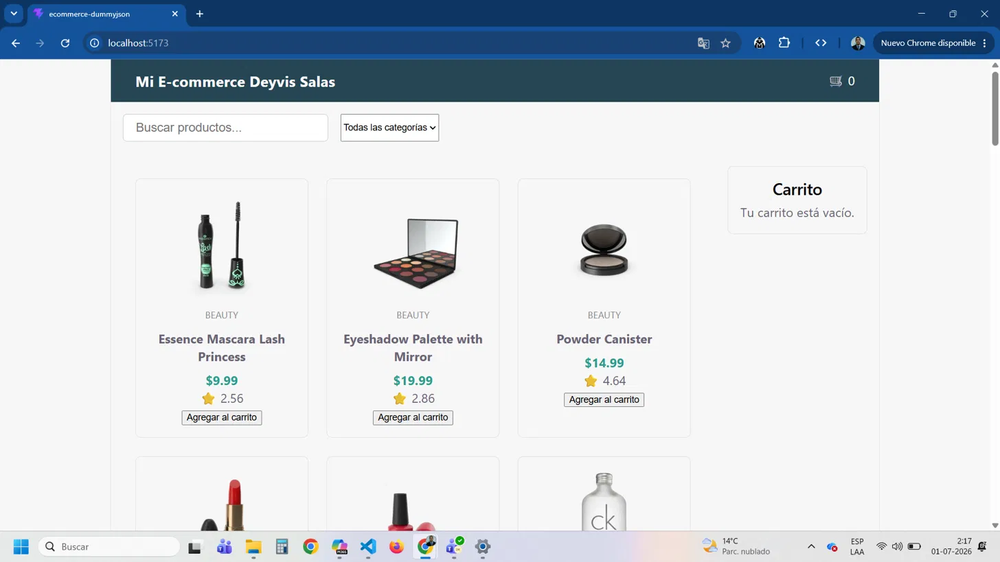
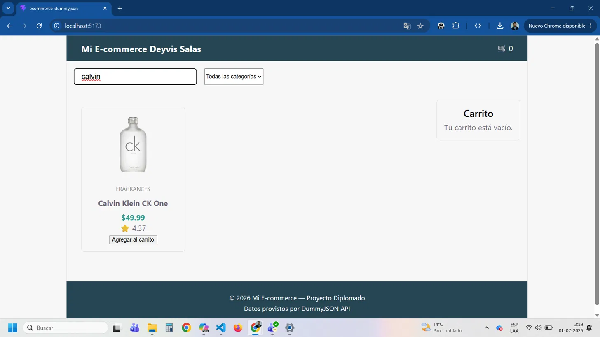
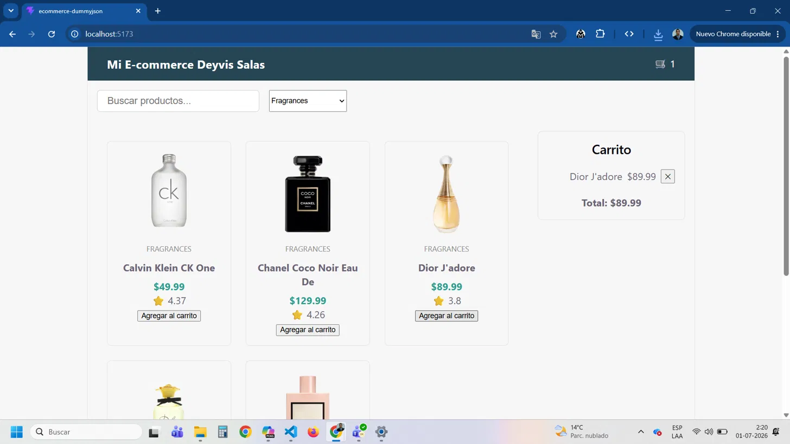
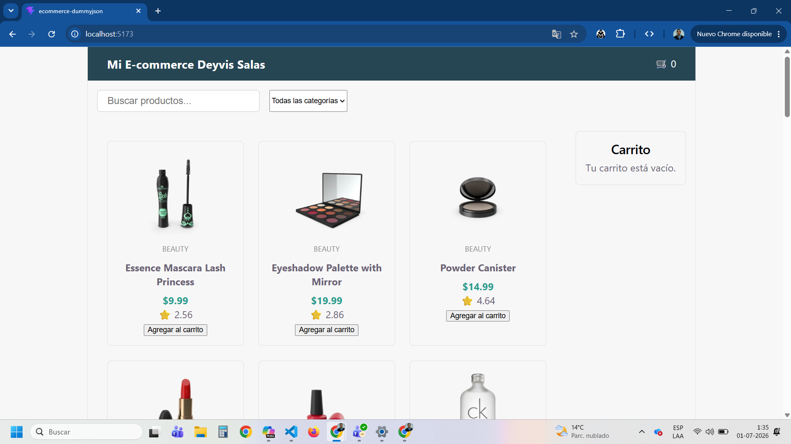

# Mi E-commerce Deyvis Salas — React + DummyJSON API

Aplicación de e-commerce construida en React que consume la API pública de [DummyJSON](https://dummyjson.com/docs/products) para mostrar productos de forma dinámica, con búsqueda, filtro por categoría y carrito de compras.

## Funcionalidades

- Renderizado dinámico de productos desde una API real
- Búsqueda por nombre de producto
- Filtro por categoría
- Carrito de compras con contador y total
- Diseño responsivo (mobile y desktop)

## Tecnologías

- React
- Vite
- CSS puro (Flexbox/Grid)
- DummyJSON API

## Instalación

\`\`\`bash
git clone https://github.com/DeyvisRon1/ecommerce-dummyjson.git
cd ecommerce-dummyjson
npm install
npm run dev
\`\`\`

La app corre por defecto en `http://localhost:5173`.

## Capturas de pantalla

## Estructura del proyecto

\`\`\`
src/
  components/
    Cart/
    ErrorMessage/
    FilterBar/
    Footer/
    Header/
    Loader/
    ProductCard/
    ProductList/
    SearchBar/
  hooks/
    useProducts.js
  services/
    api.js
  App.jsx
\`\`\`

## Componentes

| Componente   | Responsabilidad |
|--------------|------------------|
| Header       | Muestra el logo y el contador del carrito |
| Loader       | Indicador visual mientras se cargan los productos desde la API
| ErrorMessage | Muestra un mensaje si falla la consulta a la API
| SearchBar    | Input controlado para buscar productos |
| FilterBar    | Select controlado para filtrar por categoría |
| ProductList  | Recorre el array de productos y renderiza ProductCard |
| ProductCard  | Muestra los datos de un producto individual |
| Cart         | Lista los productos agregados y el total |
| Footer       | Información básica del proyecto 

## Autor

Deyvis Salas Ron

## Aprendizajes

Este proyecto fue mi segunda entrega del modulo 2 React, después de una primera evaluación donde me faltó aplicar estado real en los componentes. Acá me enfoqué en resolver justamente eso:

- Usé `useState` y `useEffect` para manejar datos asíncronos desde una API real (DummyJSON), incluyendo estados de carga y error.
- Aprendí a "levantar el estado" (lifting state up) cuando varios componentes hermanos, como el buscador y el filtro, necesitaban compartir la misma información.
- Separé la lógica de conexión con la API en un servicio (`services/api.js`) y en un custom hook (`hooks/useProducts.js`), en vez de mezclarla directamente en los componentes.
- Implementé un carrito de compras funcional, pasando eventos hacia arriba mediante props (`onAddToCart`, `onRemove`) para que cada componente mantuviera una única responsabilidad.
- Ajusté el diseño para que fuera responsivo, probando en distintos tamaños de pantalla con las DevTools del navegador.